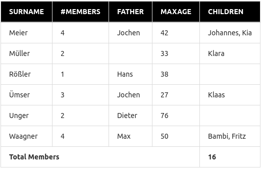

## SELECTED GEEKS PHP Challenge

**Welcome to SELECTED GEEKS PHP Challenge**

The challenge is not designed to be completed to 100%. So don't worry if you can't finish all the tasks. :)
We just wanted to give you more options with the tasks, that is why we got many :). Just try to complete as much as you can.

Your tasks are as follows:

**Task 1 (Mandatory)**

Create a REST endpoint which will execute the Import feature for the provided **product catalog** sample.

- Design and build an Import handler for the provided product catalog files (XML & JSON).
- Implementation for one of formats and also make sure it is extendable & scalable.
- Primarily the design for the import should detect format, validate/parse data & write data into database.
- Validate the data for missing attributes & record the errors accordingly.
- Create a database design based on data in sample catalog provided.
- Save the data to MySQL database.
- Write necessary Unit tests.

What we look for ?
- A containerised end result using docker would be ideal.
- Make sure to add Unit tests wherever necessary.
- Custom Implementation with clean code.
- Solution should be extendable, scalable & performant.
- Necessary Documentation.
- Please focus on the approach to the solution and not just completing all requirements, as the former is important to latter.

**Note**
- The task has to be done with PHP Language without using any framework, but can use PHP libraries/plugins.


**Task 2**

Create ONE SQL query for which creates an evaluation over the table families.

The following data should be in the GUI result:




- One line for each surname
- Use surname as first sorting value
- Number of family members as column members
- First name of the male legal guardian as column father
- Age of the oldest family member as column maxAge
- List of all children first name separated by comma as column children, the names should be sorted alphabetically
- Table heading <th> should be in an uppercase with black background and white bold font.
- Implementation of sorting on table heading (optional).

**SQL INSERT**

```sql
INSERT INTO `families`
(`ID`, `first_name`, `surname`, `age`, `gender`, `legal_guardian`)
VALUES
(1 ,'Jochen',    'Meier',    42 ,'male',     1),
(2 ,'Susanne',   'Meier',    38 ,'female',   1),
(3 ,'Johannes',  'Meier',    14 ,'male',     0),
(4 ,'Kia',       'Meier',    10 ,'female',   0),
(5 ,'Sabine',    'Müller',   33 ,'female',   1),
(6 ,'Klara',     'Müller',   12 ,'female',   0),
(7 ,'Klaas',     'Ümser',    3  ,'male',     0),
(8 ,'Gabi',      'Ümser',    27 ,'female',   1),
(9 ,'Jochen',    'Ümser',    26 ,'male',     1),
(10,'Dieter',    'Unger',    72 ,'male',     1),
(11,'Gertrud',   'Unger',    76 ,'female',   1),
(12,'Hans',      'Rößler',   38 ,'male',     1),
(13,'Fritz',     'Waagner',  18 ,'male',     0),
(14,'Susi',      'Waagner',  44 ,'female',   1),
(15,'Max',       'Waagner',  50 ,'male',     1),
(16,'Bambi',     'Waagner',  13 ,'female',   0);
```

**Task 3**

Write a function that separates the street name from the rest and prints it.Also write a unit test for the function.

Use the following streets for testing:

- Einsteinstr. 7
- Einsteinstrasse 7
- Curd-Jürgens-Str. 30
- Perlcherstr.88 1
- Rosenheimerstr. 14e-f
- Bei Fußenkreuz 36
- Sankt Georgs Kirchhof 26
- Mallertshofener Strasse 36c
- Rosenheimerstr. 145 e+f
- Hof 151
- Wald a.A. 125
- Lindenhof 0
- Am Elfenholt
- Am Schießberg 35 357
- Idlhofgasse 16A-1
- Kreisbacherstrasse 3/1/19
- Höpflergasse 6 / 18
- Straße des 17. Juni
- 10th Avenue, 123
- 21B Baker St, Merylbone


**Task 4**

Find security and performance issues and fix them. Also make the script PHP 8 compatible.

```php
<?
require_once $_GET['location'];
 
$sql = 'SELECT * FROM `users` WHERE `city` = "'.$_GET['city'].'"';
$users = mysql_query($sql);
$usersFromOtherCities = [];
 
while ($users && ($user = mysql_fetch_assoc($users))) {
    if (file_exists($user['user_dir'])) {
        echo $_REQUEST['message'].' '.$user['name']."\n";
    } else {
        $usersFromOtherCities[$user['city']] = $user;
    }
}
 
echo 'Users from other cities:'."\n";
 
foreach (['Nürnberg', 'Ansbach'] as $city) {
    foreach ($usersFromOtherCities as $users) {
        foreach ($users as $user) {
            if ($user['city'] == $city) {
                echo $city.' ('.count($users).')'."\n";
                break;
            }
        }
    }
}
```


If you are stuck or need a bit of help, you are always welcome to contact us.

Best of luck for your challenge and have fun :)
